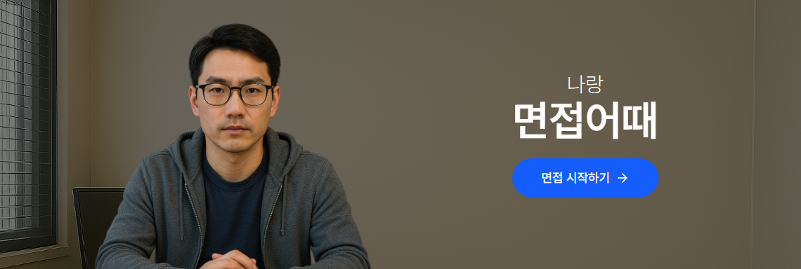

<div align="center">
  <a href="https://myeonjeob-eottae.netlify.app/" title="면접어때">
    
  </a>
</div>

<br>
<br>

# 면접어때

<div>
  
  
  
  
  
  
</div>

<br>

**면접어때는 실제 화상 면접처럼 연습하고, 녹화된 영상을 통해 스스로를 피드백할 수 있는 면접 준비 서비스입니다.**

면접에서는 누구나 자기도 모르게 실수하곤 합니다.

말이 너무 빠르진 않았나요?  
같은 표현을 반복하진 않았나요?  
표정이나 자세는 어색하진 않았나요?

**내 모습을 직접 확인하는 것, 그것이 가장 효과적인 면접 준비입니다.**

[면접어때로 면접 시작하기 🧑‍💻](https://myeonjeob-eottae.netlify.app/)

## 면접 연습하기

### 실제 면접과 유사한 환경에서 연습하세요.

면접어때는 구글 미트와 유사하게 디자인되어 실제 화상 면접처럼 연습할 수 있어요.  
익숙해진 만큼 실제 화상면접에서 당황하지 않고 자신 있게 말할 수 있어요.

<div align="center"></div>

### 면접 질문을 내 마음대로 구성하세요.

사이드 패널을 통해 연습할 면접 질문 리스트를 수정할 수 있어요.  
나에게 맞는 질문 리스트를 구성하세요.

<div align="center"></div>

### 녹화된 내 모습을 확인하세요.

녹화된 영상으로 내 모습을 직접 확인할 수 있어요.  
몰랐던 습관을 발견하고, 더 나은 면접을 준비하세요.

<div align="center"></div>

## 프로젝트 구조

```
 📦src
 ┣ 📂assets
 ┣ 📂constants
 ┣ 📂context
 ┣ 📂features
 ┣ 📂hooks
 ┣ 📂ui
 ┣ 📂utils
 ┣ 📜App.tsx
 ┗ 📜main.tsx
```

**`context/`**

- 전역 상태를 관리하는 React Context들

**`features/`**

- 기능 또는 페이지 단위를 기준으로 모아둔 컴포넌트들

**`ui/`**

- 재사용되는 공통 UI 컴포넌트들

**`App.tsx`**

- 전역 설정 및 라우팅 구조 정의한 루트 컴포넌트

**`main.tsx`**

- 앱의 진입점

## 로컬에서 직접 실행하기

### 1. 원격 저장소를 복제하여 설치합니다.

```bash
git clone https://github.com/heony704/myeonjeob-eottae.git
cd myeonjeob-eottae
```

### 2. 다음 명령어로 면접어때를 시작하세요.

```bash
pnpm start
```

## 문의하기

문의는 [이슈 탭](https://github.com/heony704/myeonjeob-eottae/issues) 혹은 이메일 `heony704@gmail.com`을 통해 보내주세요.
